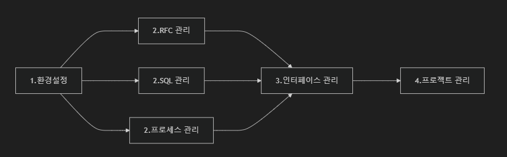
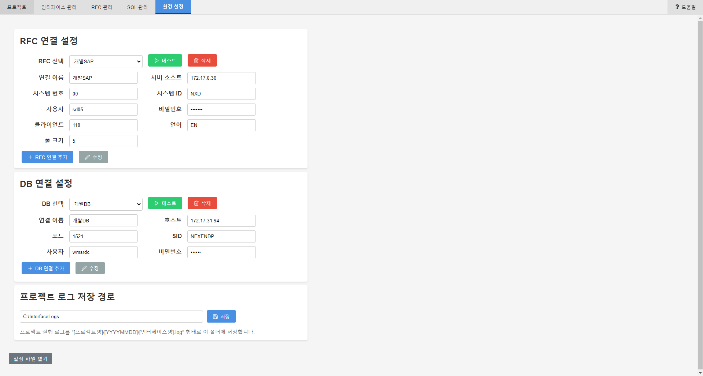
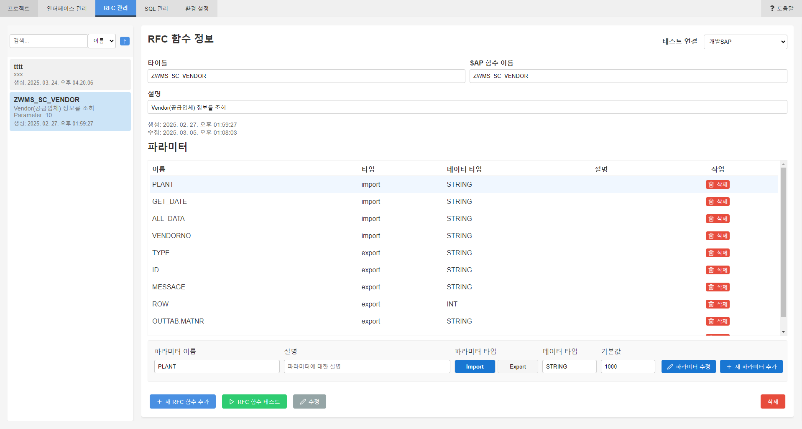
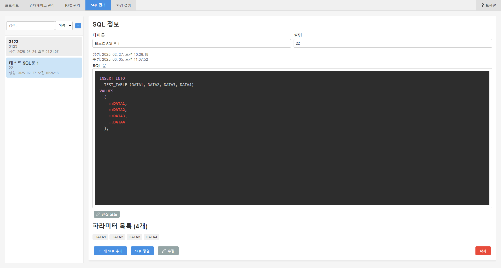
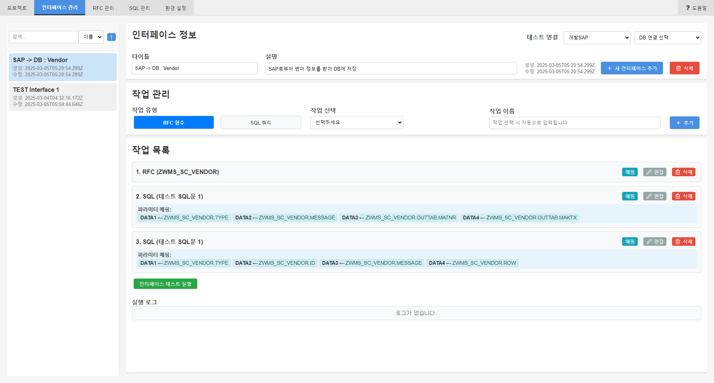
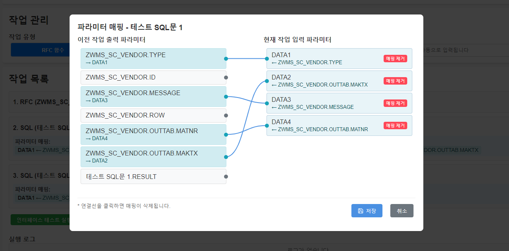

# SAP Interface Manager

## 프로젝트 개요

**SAP Interface Manager**는 **React**와 **Electron**을 사용하여 구현된 데스크탑앱입니다.
`직관적인 GUI`를 제공합니다.\
개인 취미로 개발된 앱이며, 일부 아직 기능은 구현하지 않았으나 전체적인 프로세스는 구현되었습니다.

`SAP`와, `데이터베이스`와 연동하여 데이터를 송/수신하며, 비지니스 로직에 따라 `인터페이스 관리`, `자동 스케줄링`, `실시간 로깅` 등의 기능을 제공합니다.\
이 도구는 RFC 및 Oracle 데이터베이스 수정 작업 등 모든 `작업 단위`를 `모듈화`합니다.\
데이터 인터페이스를 구축하는데 있어 개발 스킬을 요구하지 않고도, 소스 코드 작성없이 다양한 `인터페이스 구현`과 편리한 `유지보수`및 `확장성` 을 제공합니다.

## 🚀 주요 기능

- **SAP 연동**: RFC를 통해 SAP 시스템과 연결하여 데이터를 송/수신합니다.
- **Oracle DB 연동**: Oracle DB에 데이터를 삽입 및 업데이트합니다.
- **인터페이스 관리**: 다양한 인터페이스를 관리하고 설정할 수 있습니다.
- **스케줄링 & 자동화**: 작업을 예약하고 자동화할 수 있습니다.
- **실시간 로깅 터미널**: 실시간으로 로그를 수집하고 모니터링합니다.

## 🛠️ 사용 가이드



1. 환경설정

   - RFC 접속정보 세팅
   - DB 접속정보 세팅
   - 로그 파일 생성 경로 변경

     

2. 작업 단위 생성 (일부 개발 중)

   - RFC 관리

     - RFC 파라미터 세팅
     - RFC 테스트

       

   - SQL 관리

     - SQL문 생성, 입/출력 파라미터 지정

       

   - 프로세스 관리
     - 조건 분기 / RFC, SQL 외 특수 동작 설정

3. 인터페이스 관리

   - 생성된 작업 단위(RFC, SQL) 를 선택하여 인터페이스를 구성

     

   - 필요하다면 작업간 파라미터를 매핑

     

4. 프로젝트 관리

   - 생성된 인터페이스를 하나의 프로젝트 단위로 생성
   - 실시간 모니터링과 로깅
   - 인터페이스 자동 스케줄링
   - 프로젝트 단위로 실행 및 관리

     

## 🛠️ 설치

### 필수 조건

- **Oracle DB 클라이언트** (oracledb 패키지 사용을 위해)
- **SAP RFC SDK** (v7.50)

### 저장소 클론 시

```bash
git clone https:://github.com/rhupy/sap-interface-manager.git
cd sap-interface-manager
```

- **Node.js** (v16.x 이상)
- **npm** (v7.x 이상)

### Oracle DB 사용 시, 다중 SQL문 처리를 위한 아래 Stored Procedure 를 사전 생성 (EXEC_MULTI_DATA_SQL)

```bash
CREATE OR REPLACE PROCEDURE WMSRDC.EXEC_MULTI_DATA_SQL(
  p_json_data CLOB,
  p_sql_template CLOB,
  p_column_mappings CLOB,
  p_regular_params CLOB
) AS
  v_sql CLOB;
  v_data_count NUMBER;
  v_current_sql CLOB;
  v_column_name VARCHAR2(100);
  v_column_value VARCHAR2(4000);
  v_param_name VARCHAR2(100);
  v_param_value VARCHAR2(4000);
BEGIN
  -- 데이터 행 수 계산
  SELECT COUNT(*)
  INTO v_data_count
  FROM JSON_TABLE(p_json_data, '$[*]'
    COLUMNS (dummy PATH '$.MATNR'));

  v_current_sql := p_sql_template;

  -- 일반 파라미터 대체
  IF p_regular_params IS NOT NULL THEN
    FOR param IN (SELECT param_name, param_value
                  FROM JSON_TABLE(p_regular_params, '$[*]' COLUMNS (
                    param_name VARCHAR2(100) PATH '$.param_name',
                    param_value VARCHAR2(4000) PATH '$.param_value'
                  ))) LOOP
      v_param_name := param.param_name;
      v_param_value := param.param_value;
      -- 값이 문자열이면 따옴표 추가
      IF REGEXP_LIKE(v_param_value, '^[0-9]+(\.[0-9]+)?$') THEN
        v_current_sql := REPLACE(v_current_sql, '::' || v_param_name, v_param_value);
      ELSE
        v_current_sql := REPLACE(v_current_sql, '::' || v_param_name, '''' || REPLACE(v_param_value, '''', '''''') || '''');
      END IF;
      DBMS_OUTPUT.PUT_LINE('Regular param replaced: ::' || v_param_name || ' -> ' || v_param_value);
    END LOOP;
  END IF;

  -- 각 데이터 행 처리
  FOR i IN 0..v_data_count-1 LOOP
    v_sql := v_current_sql;

    FOR mapping IN (SELECT param_name, json_path
                    FROM JSON_TABLE(p_column_mappings, '$[*]' COLUMNS (
                      param_name VARCHAR2(100) PATH '$.param_name',
                      json_path VARCHAR2(100) PATH '$.json_path'
                    ))) LOOP
      v_column_name := mapping.param_name;
      v_column_value := JSON_VALUE(p_json_data, '$[' || i || '].' || mapping.json_path);

      IF v_column_value IS NULL THEN
        v_column_value := 'NULL';
      ELSE
        IF REGEXP_LIKE(v_column_value, '^[0-9]+(\.[0-9]+)?$') = FALSE THEN
          v_column_value := '''' || REPLACE(v_column_value, '''', '''''') || '''';
        END IF;
      END IF;

      v_sql := REPLACE(v_sql, '::' || v_column_name, v_column_value);
      DBMS_OUTPUT.PUT_LINE('Column replaced: ::' || v_column_name || ' -> ' || v_column_value);
    END LOOP;

    -- 생성된 SQL 출력 및 실행
    DBMS_OUTPUT.PUT_LINE('Generated SQL: ' || v_sql);
    EXECUTE IMMEDIATE v_sql;
  END LOOP;

  COMMIT;
EXCEPTION
  WHEN OTHERS THEN
    ROLLBACK;
    RAISE_APPLICATION_ERROR(-20001, 'Error in EXEC_MULTI_DATA_SQL: ' || SQLERRM);
END;
```
